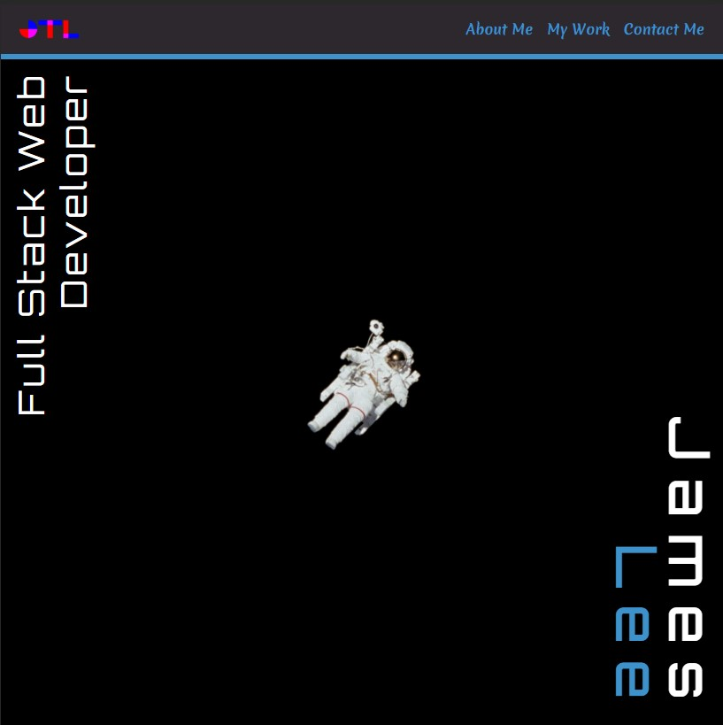
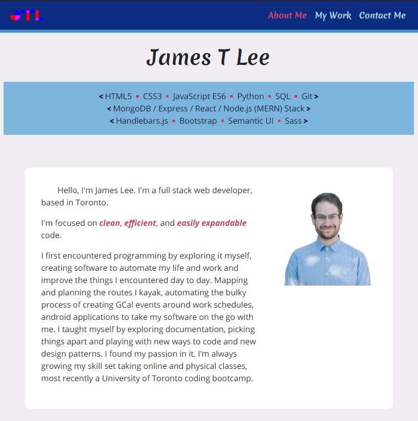
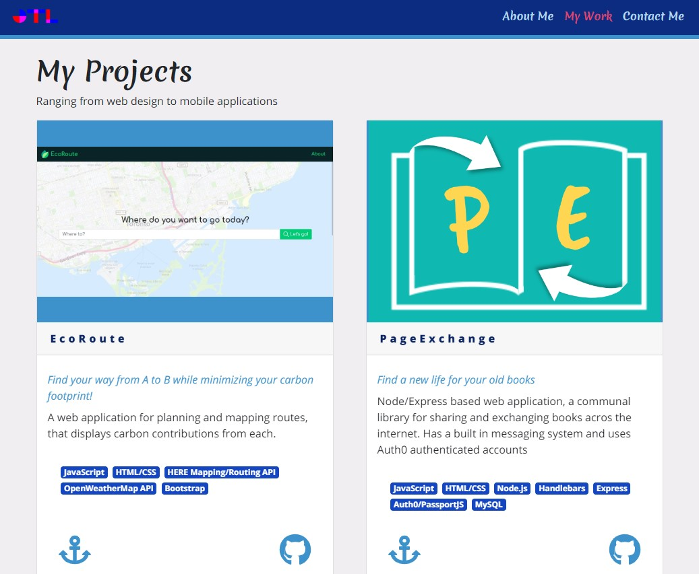

# Jamesdeveloping.ca

My personal webpage, created to showcase my skills and host my bio and portfolio. This version is created using React and React-Bootstrap. [It can be found deployed to Heroku here.](https://jamesdeveloping.netlify.app/)

## Technologies

-   Node
-   React
-   Bootstrap
-   React-Bootstrap
-   Sass
-   GSAP
-   AOS

## Author

Created by James Lee

## Credits

-   [Node](https://nodejs.org/en/)
-   [React](https://reactjs.org/)
-   [Bootstrap](https://getbootstrap.com/)
-   [React-Bootstrap](https://github.com/react-bootstrap/react-bootstrap)
-   [Sass](https://sass-lang.com/)
-   [GSAP](https://greensock.com/gsap/)
-   [AOS](https://michalsnik.github.io/aos/)
